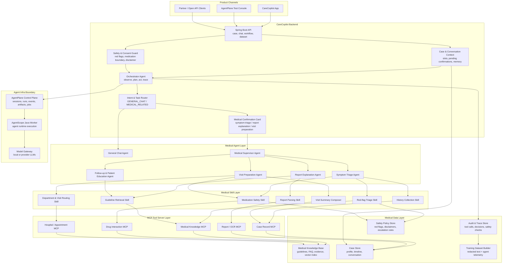

# CareCopilot

[中文文档](README.zh-CN.md)

CareCopilot is a Java and Spring Boot backend for a Chinese medical-assistant agent product. It focuses on agent orchestration, medical safety boundaries, auditable execution traces, and trainable telemetry. The current repository intentionally keeps the UI thin or external, so the core backend and agent contract can evolve cleanly.

> Medical safety notice: CareCopilot is not a medical device and does not replace clinicians. It is a reference implementation for medical-assistant workflows, safety routing, and agent infrastructure integration.

## What It Does

- Creates medical cases and binds each case to an AgentPlane session.
- Detects top-level chat intent as either general conversation or medical-related demand.
- Presents a confirmation-card contract only after medical intent is detected.
- Supports three medical task candidates: symptom triage, report explanation, and visit preparation.
- Maintains multi-turn medical inquiry context and supports clearing chat context.
- Checks red-flag symptoms and medication-change safety boundaries.
- Emits timeline entries, audit events, AgentPlane runs, artifacts, and task jobs.
- Exports trainable JSONL records from redacted text and agent telemetry.
- Provides health probes, Prometheus metrics, Docker Compose, Kubernetes, and Helm deployment assets.

## Architecture Blueprint



CareCopilot is the domain agent application. AgentPlane is the infrastructure control plane that records sessions, runs, events, artifacts, and worker jobs. The current backend implements the case store, conversation context, medical confirmation flow, three medical workflows, audit trail, dataset export, and AgentPlane integration. The knowledge base, MCP tool servers, and richer skill layer define the next production architecture surface.

## Repository Layout

```text
.
├── deploy/                  # Docker Compose, Kubernetes, and Helm assets
├── docs/                    # Deployment and operations notes
├── src/main/java/dev/carecopilot
│   ├── agentplane/          # AgentPlane HTTP client and DTOs
│   ├── api/                 # REST controllers and API error handling
│   ├── domain/              # Request and response records
│   ├── service/             # Agent orchestration and workflow logic
│   └── store/               # In-memory and JDBC state stores
├── src/main/resources/      # Spring Boot configuration
└── src/test/java/dev/carecopilot
```

## Requirements

- Java 17
- Maven 3.9+
- Docker or Kubernetes for production-style deployment
- AgentPlane when running the full integration path

## Run Tests

```bash
mvn -q test
```

## Run Locally

Start AgentPlane on `http://127.0.0.1:18080` when you want full session/run/job integration, then run:

```bash
mvn spring-boot:run
```

The service starts on port `18081` by default.

## Production Profile

```bash
SPRING_PROFILES_ACTIVE=prod \
CARECOPILOT_JDBC_URL=jdbc:postgresql://localhost:5432/carecopilot \
CARECOPILOT_JDBC_USERNAME=carecopilot \
CARECOPILOT_JDBC_PASSWORD=carecopilot \
CARECOPILOT_AGENTPLANE_BASE_URL=http://127.0.0.1:18080 \
java -jar target/carecopilot-backend-0.1.0-SNAPSHOT.jar
```

See [docs/deployment.md](docs/deployment.md) for Docker Compose, Kubernetes, Helm, and dataset export examples.

## API Surface

- `POST /cases`
- `GET /cases/{caseId}`
- `GET /cases/{caseId}/timeline`
- `GET /cases/{caseId}/audit-events`
- `POST /chat/intent`
- `POST /chat/confirm`
- `POST /chat/context/clear`
- `POST /workflows/symptom-intake`
- `POST /workflows/report-explanation`
- `POST /workflows/visit-preparation`
- `POST /datasets/export/jsonl`
- `GET /evals/carecopilot/mvp`
- `GET /actuator/health/readiness`
- `GET /actuator/prometheus`

## License

Apache License 2.0. See [LICENSE](LICENSE).
