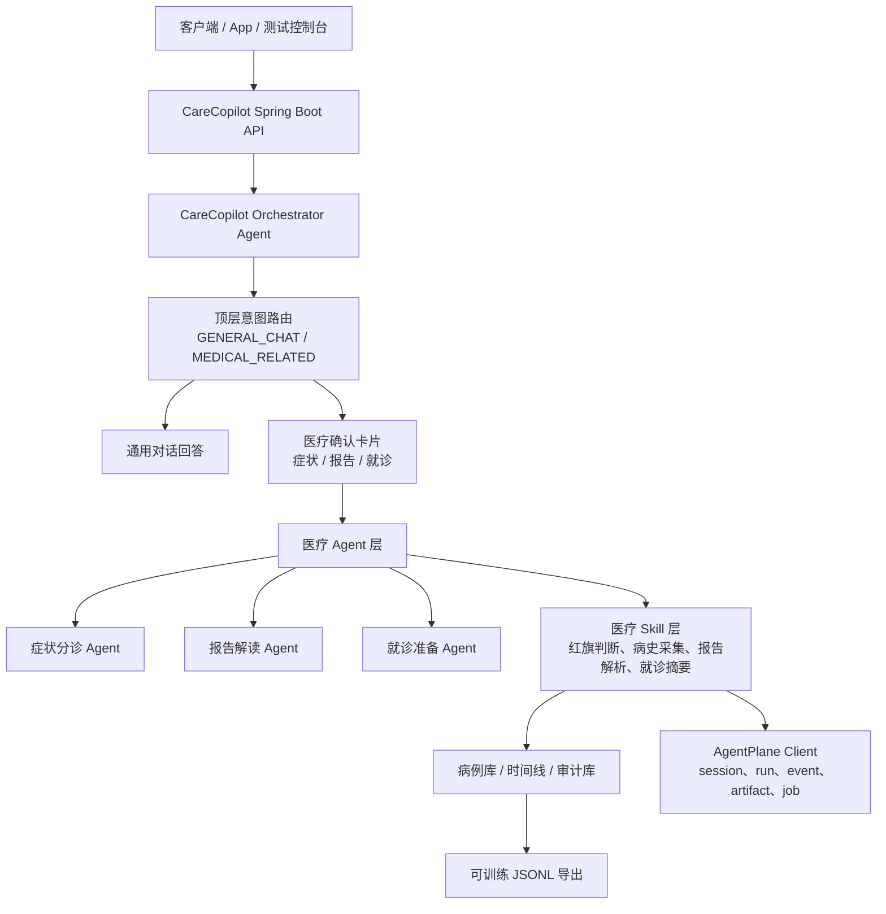

# CareCopilot

[English README](README.md)

CareCopilot 是一个面向中文医疗助手产品的 Java / Spring Boot 后端项目。它重点实现医疗 Agent 的编排、安全边界、可审计执行轨迹和可训练 telemetry，而不是优先做 UI。当前项目适合作为医疗 Agent 应用后端，以及与 AgentPlane 这类 Agent Infra 平台集成的参考实现。

> 医疗安全说明：CareCopilot 不是医疗器械，不能替代医生诊断、治疗或急救服务。本项目用于医疗助手工作流、安全路由和 Agent Infra 集成实践。

## 核心能力

- 创建病例，并把每个病例绑定到 AgentPlane session。
- 将用户输入先识别为通用对话或医疗相关需求。
- 只有识别到医疗相关需求后，才返回确认卡片契约。
- 支持三类医疗任务候选：症状分诊、报告解读、就诊准备。
- 支持多轮医疗问询上下文，并提供清空上下文接口。
- 内置红旗症状和用药变更安全边界检查。
- 记录病例时间线、审计事件、AgentPlane run、artifact 和 task job。
- 从脱敏文本与 Agent 执行 telemetry 导出可训练 JSONL 数据。
- 提供健康检查、Prometheus 指标、Docker Compose、Kubernetes 和 Helm 部署资产。

## 架构



CareCopilot 是医疗领域 Agent 应用，AgentPlane 是底层 Agent Infra 控制平面。CareCopilot 通过 AgentPlane 记录 session、run、event、artifact 和 worker job。开发环境可使用内存状态存储，生产环境可使用 PostgreSQL。

## 目录结构

```text
.
├── deploy/                  # Docker Compose、Kubernetes、Helm 部署资产
├── docs/                    # 部署与运维说明
├── src/main/java/dev/carecopilot
│   ├── agentplane/          # AgentPlane HTTP Client 与 DTO
│   ├── api/                 # REST Controller 与错误处理
│   ├── domain/              # 请求和响应模型
│   ├── service/             # Agent 编排与医疗工作流逻辑
│   └── store/               # 内存与 JDBC 状态存储
├── src/main/resources/      # Spring Boot 配置
└── src/test/java/dev/carecopilot
```

## 环境要求

- Java 17
- Maven 3.9+
- Docker 或 Kubernetes，用于生产化部署验证
- 如需完整 session/run/job 链路，需要启动 AgentPlane

## 运行测试

```bash
mvn -q test
```

## 本地运行

如需完整集成链路，先启动 AgentPlane 并暴露在 `http://127.0.0.1:18080`，然后运行：

```bash
mvn spring-boot:run
```

默认服务端口为 `18081`。

## 生产 Profile

```bash
SPRING_PROFILES_ACTIVE=prod \
CARECOPILOT_JDBC_URL=jdbc:postgresql://localhost:5432/carecopilot \
CARECOPILOT_JDBC_USERNAME=carecopilot \
CARECOPILOT_JDBC_PASSWORD=carecopilot \
CARECOPILOT_AGENTPLANE_BASE_URL=http://127.0.0.1:18080 \
java -jar target/carecopilot-backend-0.1.0-SNAPSHOT.jar
```

Docker Compose、Kubernetes、Helm 和数据集导出示例见 [docs/deployment.md](docs/deployment.md)。

## API

- `POST /cases`
- `GET /cases/{caseId}`
- `GET /cases/{caseId}/timeline`
- `GET /cases/{caseId}/audit-events`
- `POST /chat/intent`
- `POST /chat/confirm`
- `POST /chat/context/clear`
- `POST /workflows/symptom-intake`
- `POST /workflows/report-explanation`
- `POST /workflows/visit-preparation`
- `POST /datasets/export/jsonl`
- `GET /evals/carecopilot/mvp`
- `GET /actuator/health/readiness`
- `GET /actuator/prometheus`

## 开源协议

Apache License 2.0，见 [LICENSE](LICENSE)。
